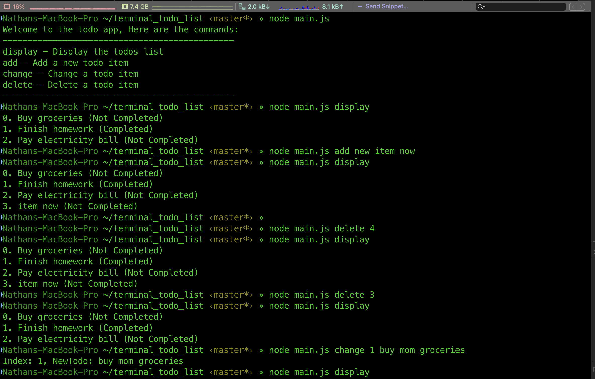

# Terminal Todo List

A simple and efficient command-line todo list application for managing your tasks directly from the terminal.



## Features

- Manage todos using a separate JSON file (`todos.json`).
- Simple commands for displaying, adding, changing, toggling, and deleting todos.
- Written in JavaScript using Node.js.

## Getting Started

### Prerequisites

- [Node.js](https://nodejs.org/en/) installed on your machine.

### Installation

1. Clone the repository:

```
git clone https://github.com/nathannosudo/terminal_todo_list.git
```

2. Move into the project directory:

```
cd terminal_todo_list
```

3. Try and run it wihtout running `npm install`. If it does not work then you still need the required dependencies:

'''
npm install fs
'''

## Usage

The application supports the following commands:

- `display`: Display the todos.
- `add`: Add a new todo.
- `change`: Change the content of a todo.
- `toggle`: Toggle the completion status of a todo.
- `delete`: Delete a todo.

- run `node main.js` and it will list out the available commands then follow the examples below to use it.
### Examples

1. Display todos:

 ```
 node main.js display
 ```

2. Add a new todo:

```
node main.js add clean room
```

3. Change the content of a todo at index 1:

```
node main.js change 0 clean my room
```

4. Toggle the completion status of a todo at index 0:

```
node main.js toggle 0
```

5. Delete a todo at index 2:

```
node main.js delete 2
```
## Contributing

Feel free to fork this repository and make your own modifications or improvements. Pull requests are welcome!

## License

This project is licensed under the MIT License - see the [LICENSE](LICENSE) file for details.

## Acknowledgments

- Thanks to [Nathan Orris](https://github.com/nathannosudo) for creating this project.


